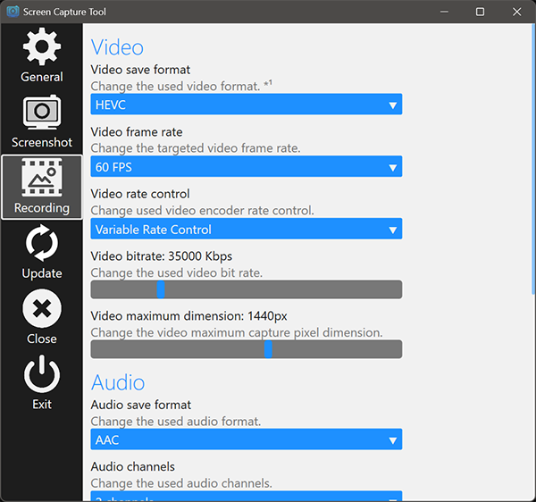

## Application Description
Screen Capture Tool allows you to easily capture your screen to an image or video file.

## Application Features
- Save screencapture as JXR, PNG, JPG, BMP, TIF, HEIF or MP4.
- Keyboard shortcuts to capture screen on demand.
- HDR to SDR tonemapping when needed.

## Installation Instructions
1) Extract the ScreenCaptureTool folder to any directory you want on your device.
2) Make sure that you have installed all the requirements listed below.
3) Run the Launcher executable and start capturing your screen.

## Uninstallation Instructions
1) Remove the extracted ScreenCaptureTool directory.

## Tips and tricks
- Let Screen Capture Tool automatically launch on Windows startup for easier alltime usage.
- For more information and help open the "Help" window or tab in the application.

## Known issues
- Overlays may not always show up when you are in an exclusive fullscreen application.
- Some content with HDR or DRM protection might not be captured.

## Requirements
- Microsoft .NET Core Runtime installed.
- Microsoft HEVC Video Extensions installed.
- Microsoft Visual C++ Redistributable installed.
- Microsoft Windows 11 64-bit or higher is required.

## Support and bug reporting
When you are walking into any problems or a bug you can go to my help page at https://help.arnoldvink.com so I can try to help you out and get everything working.

## Developer donation
If you appreciate my project and want to support me you can make a donation through https://donation.arnoldvink.com

## Changelog
v2.5.0.0 (22-September-2025)
- Changed frame rate setting to slider from 1 to 120 fps.

v2.4.0.0 (20-June-2025)
- Added setting to include window title in filename.
- Middle mouse click on tray icon stops video capture.
- Added capture error message to overlay.

v2.2.0.0 (24-December-2024)
- Released Screen Capture Tool.